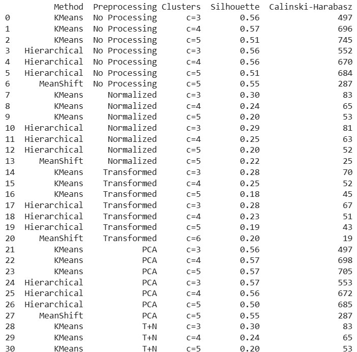
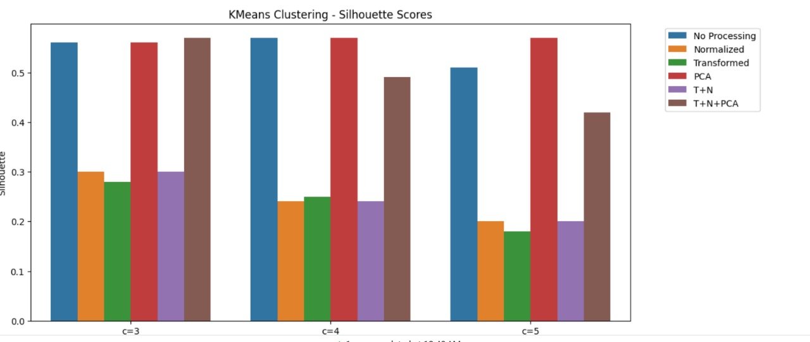

# Clustering on Wine Dataset

Author: **Vardhan Singh Rawat**  
Roll Number: **102203268**

## Project Overview

This project applies multiple clustering algorithms to the popular Wine dataset from scikit-learn, evaluating the results under various preprocessing conditions.

The Wine dataset contains **13 features** describing different chemical properties of wines, classified into three types.

## Key Components

- **Preprocessing Techniques**:
  - No Processing
  - Normalization (Min-Max Scaling)
  - Standardization (Z-score Scaling)
  - PCA (Principal Component Analysis) to 2 dimensions
  - Standardization + Normalization
  - Standardization + Normalization + PCA

- **Clustering Algorithms**:
  - **KMeans** (for clusters = 3, 4, 5)
  - **Hierarchical (Agglomerative)** Clustering (for clusters = 3, 4, 5)
  - **MeanShift** (automatic bandwidth estimation)

- **Evaluation Metrics**:
  - **Silhouette Score**
  - **Calinski-Harabasz Index**
  - **Davies-Bouldin Index**

## Results

The project collects and displays the clustering performance across all preprocessing techniques and clustering methods using three popular cluster evaluation metrics.

## Technologies Used

- Python
- Libraries:
  - numpy
  - pandas
  - matplotlib
  - seaborn
  - scikit-learn

## How to Run

1. Install the required libraries if not already installed:
    ```bash
    pip install numpy pandas matplotlib seaborn scikit-learn
    ```

2. Run the Python file. It will print the clustering performance table directly.



## Image



## License

This project is licensed for educational purposes.

---

